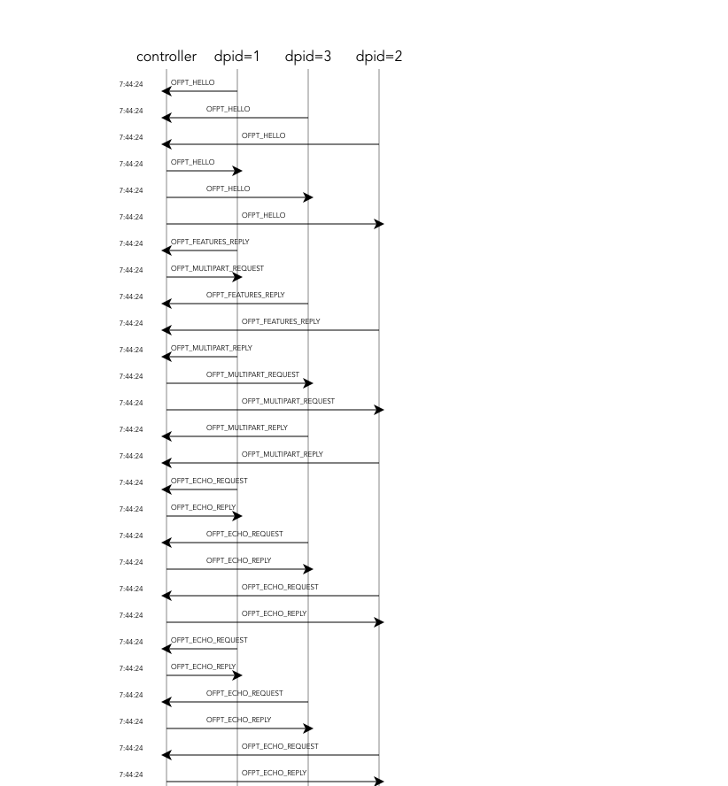

# OpenFlow Proxy (ofcapture)

This program monitors the communication between switches and controller, 
and reproduces the flow table from the messages.
This is designed to separate the application from proxy.
Now, The proxy only mediates the TCP communication, but does not filter or send packets.
It supports only OpenFlow 1.3.

## Examples
```
$ python3 ofcapture.py 
^C
2021-11-25 12:02:40.940221 switch(dpid=1) -> controller OFPT_HELLO(xid=27) 
2021-11-25 12:02:40.941010 switch(dpid=3) -> controller OFPT_HELLO(xid=28) 
2021-11-25 12:02:40.941753 switch(dpid=2) -> controller OFPT_HELLO(xid=29) 
2021-11-25 12:02:40.942793 controller -> switch(dpid=1) OFPT_HELLO(xid=812221501) 
2021-11-25 12:02:40.942793 controller -> switch(dpid=1) OFPT_FEATURES_REQUEST(xid=812221502) 
2021-11-25 12:02:40.949017 controller -> switch(dpid=3) OFPT_HELLO(xid=652508825) 
2021-11-25 12:02:40.949017 controller -> switch(dpid=3) OFPT_FEATURES_REQUEST(xid=652508826) 
2021-11-25 12:02:40.949416 controller -> switch(dpid=2) OFPT_HELLO(xid=1589678034) 
2021-11-25 12:02:40.949416 controller -> switch(dpid=2) OFPT_FEATURES_REQUEST(xid=1589678035) 
2021-11-25 12:02:41.432534 switch(dpid=1) -> controller OFPT_FEATURES_REPLY(xid=812221502) 
2021-11-25 12:02:41.433286 switch(dpid=3) -> controller OFPT_FEATURES_REPLY(xid=652508826) 
2021-11-25 12:02:41.433688 switch(dpid=2) -> controller OFPT_FEATURES_REPLY(xid=1589678035) 
2021-11-25 12:02:41.437124 controller -> switch(dpid=1) OFPT_MULTIPART_REQUEST(xid=812221503) 
2021-11-25 12:02:41.437124 controller -> switch(dpid=1) OFPT_FLOW_MOD(xid=812221504) 
2021-11-25 12:02:41.437859 controller -> switch(dpid=3) OFPT_MULTIPART_REQUEST(xid=652508827) 
2021-11-25 12:02:41.437859 controller -> switch(dpid=3) OFPT_FLOW_MOD(xid=652508828) 
2021-11-25 12:02:41.438243 controller -> switch(dpid=2) OFPT_MULTIPART_REQUEST(xid=1589678036) 
2021-11-25 12:02:41.438243 controller -> switch(dpid=2) OFPT_FLOW_MOD(xid=1589678037) 
2021-11-25 12:02:41.447387 switch(dpid=1) -> controller OFPT_MULTIPART_REPLY(xid=812221503) 
2021-11-25 12:02:41.447963 switch(dpid=3) -> controller OFPT_MULTIPART_REPLY(xid=652508827) 
2021-11-25 12:02:41.448323 switch(dpid=2) -> controller OFPT_MULTIPART_REPLY(xid=1589678036) 
2021-11-25 12:02:46.438264 switch(dpid=1) -> controller OFPT_ECHO_REQUEST(xid=0) 
2021-11-25 12:02:46.439206 switch(dpid=3) -> controller OFPT_ECHO_REQUEST(xid=0) 
2021-11-25 12:02:46.439349 switch(dpid=2) -> controller OFPT_ECHO_REQUEST(xid=0) 
2021-11-25 12:02:46.450012 controller -> switch(dpid=1) OFPT_ECHO_REPLY(xid=0) 
2021-11-25 12:02:46.455784 controller -> switch(dpid=3) OFPT_ECHO_REPLY(xid=0) 
2021-11-25 12:02:46.456258 controller -> switch(dpid=2) OFPT_ECHO_REPLY(xid=0) 
2021-11-25 12:02:51.450389 switch(dpid=1) -> controller OFPT_ECHO_REQUEST(xid=0) 
2021-11-25 12:02:51.452831 controller -> switch(dpid=1) OFPT_ECHO_REPLY(xid=0) 
2021-11-25 12:02:51.461787 switch(dpid=3) -> controller OFPT_ECHO_REQUEST(xid=0)
```


## web system

